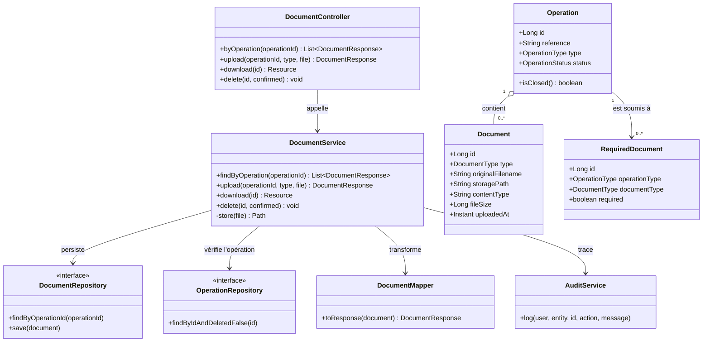
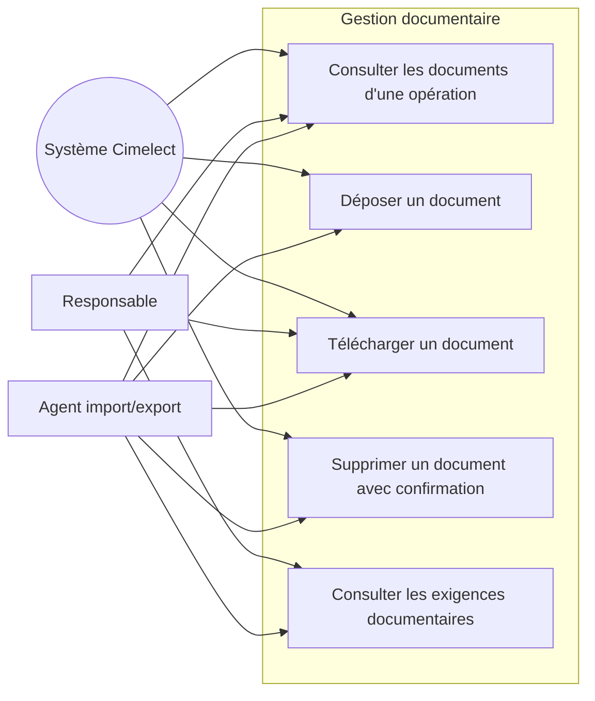
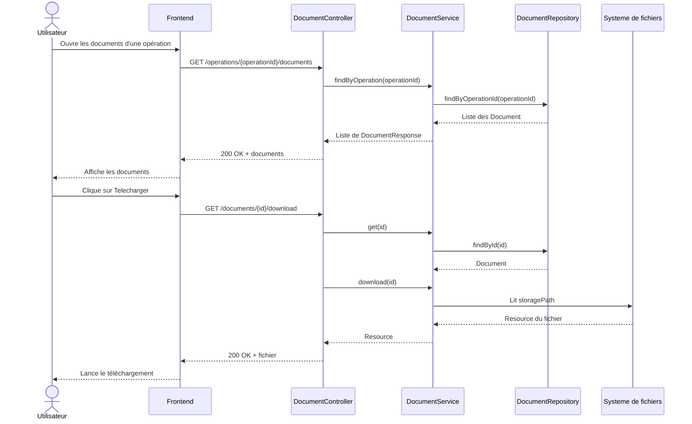
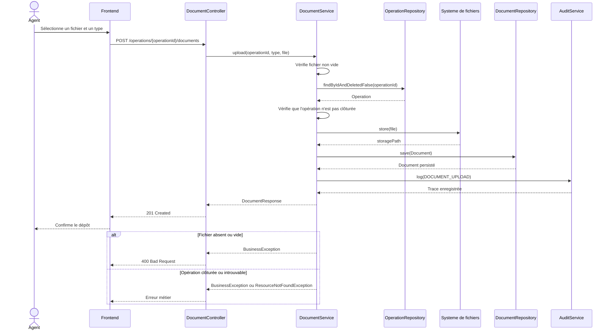

# Conception OOP et UML

Cette documentation sert de base à la conception objet de Cimelect. Les diagrammes décrivent
la fonctionnalité importante de **gestion documentaire d'une opération** : consulter,
télécharger et déposer les documents liés à une opération. L'authentification,
l'autorisation et le JWT sont volontairement exclus des scénarios ci-dessous afin de
se concentrer sur le fonctionnement métier.

## Principes OOP à appliquer

- **Encapsulation** : les attributs des entités restent privés et sont manipulés par
  leurs méthodes ou par les services métier ; les règles ne doivent pas être placées
  dans les contrôleurs.
- **Abstraction** : les contrôleurs exposent des DTO (`DocumentResponse`) et ne
  révèlent ni les entités JPA ni le chemin physique des fichiers.
- **Héritage et polymorphisme** : les types de documents et d'opérations sont des
  énumérations extensibles (`DocumentType`, `OperationType`) ; le comportement varie
  selon le type sans dupliquer le contrôleur.
- **Responsabilité unique** : le contrôleur reçoit la requête, le service applique
  les règles, le repository persiste, le mapper transforme et le service d'audit
  trace l'action.
- **Composition** : une `Operation` possède des `Document`, des `Shipment` et des
  `OperationLine`. La suppression d'une opération doit respecter le cycle de vie de
  ses éléments associés.
- **Dépendances inversées** : `DocumentService` dépend d'abstractions d'accès aux
  données (`DocumentRepository`, `OperationRepository`) et non d'une implémentation
  SQL directe.

## Classes principales et responsabilités

| Classe | Type | Responsabilité |
|--------|------|----------------|
| `DocumentController` | Contrôleur | Expose les endpoints de consultation, dépôt, téléchargement et suppression. |
| `DocumentService` | Service métier | Vérifie le fichier et l'état de l'opération, stocke le fichier, persiste le document et déclenche l'audit. |
| `Document` | Entité | Représente un fichier lié à une opération : type, nom, taille, contenu et date de dépôt. |
| `Operation` | Entité | Porte la référence, le type, le statut et les documents associés ; une opération clôturée ne reçoit plus de document. |
| `RequiredDocument` | Entité métier | Définit les documents obligatoires selon le type d'opération. |
| `DocumentRepository` | Repository | Recherche et persiste les documents, notamment par identifiant d'opération. |
| `OperationRepository` | Repository | Recherche une opération existante et non supprimée. |
| `DocumentMapper` | Mapper | Transforme une entité `Document` en DTO de réponse. |
| `AuditService` | Service transverse | Enregistre les dépôts et suppressions dans le journal d'audit. |

## Diagramme de classes

## Diagramme de cas d'utilisation

> Les acteurs sont représentés comme déjà identifiés. Les étapes de connexion,
> de validation du JWT et de contrôle des rôles ne font pas partie de ce périmètre.

## Séquence 1 : consulter et télécharger un document

## Séquence 2 : déposer un document

